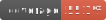

# Samba Web Dashboard

This is a project that consists of a web application to manage a Samba server through an interface built in Angular. The application interacts with a Spring Boot API, which in turn executes the necessary commands on the Samba server, encapsulated in a Docker container.

## Main Features

- **Dashboard**: Intuitive interface that displays important information about the Samba server, such as status, connected users, disk space, etc.
  
- **Share Management**: Allows you to create, edit and delete file and directory shares on the Samba server.
  
- **User and Permissions Control**: Facilitates the administration of users, groups and access permissions to shares.
  
- **Logs and Monitoring**: View Samba server logs for monitoring and diagnosing problems.

- **Documentation**: View API docs via swagger http://localhost:8080/swagger-ui/index.html#/ 

## Technologies Used

- **Angular**: Front-end development framework used to build the user interface.
  
- **Spring Boot**: Java Framework used to build the REST API that interacts with the Samba server.
  
- **Docker**: Used to encapsulate the Samba server, ensuring portability and isolation.

   

